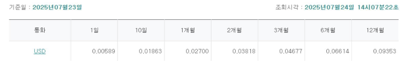

# 📌 중소기업의 환 리스크 대응 플랫폼 **「전지적 환율 시점」**

- **프로젝트 기간** : 2025/07/04 ~ 2025/07/28 (25일)

---

## 1. 프로젝트의 목적 
### - 문제상황
- **환 시장의 확대** : 2025년 2/4분기중 외국환은행의 일평균 외환거래액은 전분기 대비 12.9% 증가
- **환 리스크에 취약한 중소기업** : 2025년 2월 중소기업중앙회 조사 결과, 중소기업 2곳 중 1곳은 환 리스크에 대응하지 못하고 있었습니다.
- **환율 변동의 확대** : 글로벌적으로 정치·경제적 불확실성, 무역 갈등 확대에 따라 헤지 전략이 필요

### - 시장조사
- **KB국민은행** : 환율 전망 서비스
    - 단순히 원/달러 환율의 상승/하락/보합 확률을 그래프로 제공
    - 기업 개인의 상황을 적용할 수 있는 시스템 정도의 단계까지 도달하지 못함
    
- **하나은행** : 환율 변동성 지수
    - 단순히 평균 환율과 실제 환율 간의 표준편차(흔들림 정도)를 계산하여 제공함
    - 수치적인 변동만을 설명하여 어떤 이슈에 의한 것인지 정보량이 부족함
    
- **우리은행** : '포용적 금융 플랫폼'
    - 중소기업은 공급망·결제망·금융지원 등 핵심 인프라를 자체 구축하기가 쉽지 않음 
    - 디지털 공급망 금융 플랫폼 2025년 7월 '원비즈플라자'로 회원 7만 8천명 돌파

### - 목적
- 인력 문제로 환 리스크를 대응하지 못하는 중소기업을 지원하는 환 리스크 대응 플랫폼을 기획하였습니다.
- 나아가 중소기업이 인력 문제로 하지 못하는 일을 자체 플랫폼으로 지원함으로써 수익을 창출하고자 합니다.
- 플랫폼의 기능은 다음과 같습니다.
    - 환율을 예측하여 기업이 환전할 금액, 시점에 따른 환 리스크 대응 전략을 제안
    - 환율의 변동성을 정성적으로 보완할 수 있는 새로운 환율 변동성 지수의 개발
    - 1시간의 분량으로 직장인이 현실적으로 듣기 어려운 한국은행 환율정책방향 브리핑을 요약

## - 활용한 기술
- 언어 : Python
- 라이브러리 : Sklearn, Pytorch, Streamlit 등
- 최종 선정 모델 :
    - 환율 예측 : LSTM, XGBoost, RandomForest
    - 환율 변동성 지수 : LDA
    - 통화정책방향 브리핑 요약 : Solar Pro2 + COSTAR 프롬프트 엔지니어링

### WBS

---
## 2. 결과
- 구현한 기능

    - 환율 예측기 
        - 원/달러를 1일/1주일/1개월/3개월 후 예측
        > 핵심 코드
        - 원/위안을 1일/1주일/1개월/3개월 후 예측
        > 핵심 코드
        - 원/엔을 1일/1주일/1개월/3개월 후 예측
        > 핵심 코드
        - 원/유로를 1일/1주일/1개월/3개월 후 예측
        > 핵심 코드
    - 대한민국 EPU를 활용한 환율 변동성 지수 개발
    > 핵심 코드
    - 월별 한국은행 통화정책방향 브리핑 요약
    > 핵심 코드
- 구현하다 실패한 기능
    - 뉴스 기반의 감성분석을 통한 환율 예측기
    > 핵심 코드

## 3. 이슈사항
- 
---
## 4. 데이터 설명
---

### 1) 플랫폼 홍보 전략 데이터
- 데이터 명세서  
- 전처리 코드  

### 2) 환율 변동성 지수 개발 데이터
**테이블 정의서 – 환율변동성지수 개발**

| No | 컬럼ID          | 컬럼명      | Type        | 내용                            | 비고 |
|----|----------------|------------|-------------|---------------------------------|------|
| 1  | 뉴스 식별자     | Date       | datetime64  | 일자                            |      |
| 2  | 일자           | 일자       | datetime64  | 연-월-01 구성                   |      |
| 3  | 미환율_종가     | 미환율_종가 | float64     | 원/달러 종가                     |      |
| 4  | 한국EPU        | 한국EPU    | float64     | 공식 한국 EPU                   |      |
| 5  | one_Korea_EPU  | 직접 산출한 변수       | float64     | 국내 12개 주요 신문 기반 산출   |      |
| 6  | two_Korea_EPU  | 직접 산출한 변수         | float64     | 정책 관련 단어 확장형 지수       |      |
| 7  | three_Korea_EPU| 직접 산출한 변수         | float64     | KDI 제공 단어집 기반 지수       |      |

**테이블 정의서 – 뉴스**

| No | 컬럼ID | 컬럼명 | Type   | 내용            |
|----|--------|--------|--------|-----------------|
| 1  | 일자   | 일자   | int64  | 연월일          |
| 2  | 키워드 | 키워드 | object | 뉴스 키워드     |
| 3  | 특성추출 |특성추출(가중치순 상위 50개)  | object | 가중치순 상위 50개 |
| 4  | 본문   | 본문   | object | 뉴스 본문 내용  |
| 5  | 제목   | 제목   | object | 뉴스 제목       |

### 3) 통화정책방향 브리핑 데이터
**테이블 정의서 – 브리핑 (Sola)**

| No | 컬럼ID          | 컬럼명         | Type   | 내용                 |
|----|----------------|---------------|--------|----------------------|
| 1  | Date           | Date          | object | 개최 일자            |
| 2  | Content        | Content       | object | 브리핑 자막          |
| 3  | default_summary| default_summary| object | 기본 요약 내용       |
| 4  | sola_summary   | sola_summary  | object | COSTAR 요약 결과     |

### 4) 환율 예측 데이터
- 데이터 명세서  
- 전처리 코드  
---

## 5. 근거
- **환율 변동성 지수를 EPU로 설정한 이유** : 거시적 불확실성을 가장 잘 반영하는 대표 지표  
- **달러/위안/엔/유로를 선정한 이유**  
  - 국가별 수출입 현황 → 중국, 미국, 일본 규모가 압도적  
  - 대륙별 거래 → 아시아·북미·유럽 상위  
  - 베트남은 상위권이나 데이터 부족으로 제외  
- **부산·울산을 우선 타겟팅한 이유**  
  - 항만도시 기반 수출입 기업 비중 높음  
  - 수입 실적이 높은 기업군 → 환 리스크 관리 수요 큼  