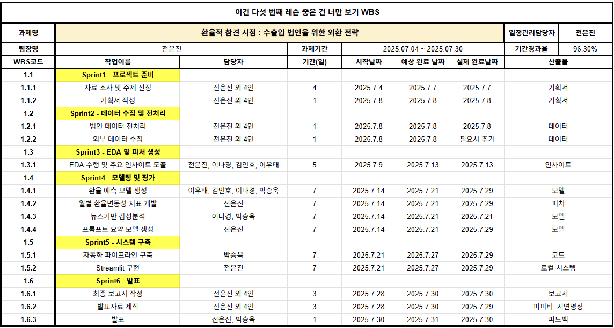

# 📌 중소기업의 환 리스크 대응 플랫폼 **「전지적 환율 시점」**

- **프로젝트 기간** : 2025/07/04 ~ 2025/07/28 (25일)

---

## 1. 프로젝트의 목적 
### 1-1. 문제상황
- **환 시장의 확대** : 2025년 2/4분기중 외국환은행의 일평균 외환거래액은 전분기 대비 12.9% 증가하며 환 시장은 계속해서 성장 중입니다.
- **환율 변동의 확대** : 글로벌적으로 정치·경제적 불확실성, 무역 갈등 확대에 따라 헤지 전략이 필요합니다.
- **환 리스크에 취약한 중소기업** : 하지만, 2025년 2월 중소기업중앙회 조사 결과, 중소기업 2곳 중 1곳은 환 리스크에 대응하지 못하고 있었습니다.

### 1-2. 시장조사
- **KB국민은행의 환율 전망 서비스**
    - 단순히 원/달러 환율의 상승/하락/보합 확률을 그래프로 제공
    - 기업 개인의 상황을 적용할 수 있는 시스템 정도의 단계까지 도달하지 못하였습니다.
    
- **하나은행의 환율 변동성 지수**
    - 단순히 평균 환율과 실제 환율 간의 표준편차(흔들림 정도)를 계산하여 제공 중이었습니다.
    - 수치적인 변동만을 설명하여 어떤 이슈에 의한 것인지 정보량이 부족합니다.
    
- **우리은행의 '포용적 금융 플랫폼'**
    - 중소기업은 공급망·결제망·금융지원 등 핵심 인프라를 자체 구축하기가 쉽지 않습니다. 
    - 이 점을 이용해, 우리은행은 디지털 공급망 금융 플랫폼 2025년 7월 '원비즈플라자'로 수익을 창출하였으며, 회원은 7만 8천명을 돌파할 저도로 인기를 끌었습니다.

### 1-3. 목적
- 인력 문제로 환 리스크를 대응하지 못하는 중소기업을 지원하는 환 리스크 대응 플랫폼을 기획하였습니다.
- 나아가 중소기업이 인력 문제로 하지 못하는 일을 자체 플랫폼으로 지원함으로써 수익을 창출하고자 합니다.
- 플랫폼의 기능은 다음과 같습니다.
    - 환율을 예측하여 기업이 환전할 금액, 시점에 따른 환 리스크 대응 전략을 제안
    - 환율의 변동성을 정성적으로 보완할 수 있는 새로운 환율 변동성 지수의 개발
    - 1시간의 분량으로 직장인이 현실적으로 듣기 어려운 한국은행 환율정책방향 브리핑을 요약

## 1-4. 활용한 기술
- **언어** : Python
- **라이브러리** : Sklearn, Pytorch, Streamlit 등
- **최종 선정 모델** :
    - **환율 예측** : LSTM, XGBoost, RandomForest
    - **환율 변동성 지수** : LDA
    - **통화정책방향 브리핑 요약** : Solar Pro2 + COSTAR 프롬프트 엔지니어링

### 1-5. WBS

### 1-6. 팀 구성

| 팀원   | 역할 및 담당 업무 |
|:------|:----------------|
| 전은진 | **팀장** – 프로젝트 총괄, 데이터 수집·가공, 환율 변동성 지수 개발, 한국은행 브리핑 요약, 시각화, Streamlit 플랫폼 구축 |
| 김인호 | **데이터 사이언티스트 / PM**|
| 박승욱 | **데이터 사이언티스트** |
| 이나경 | **데이터 사이언티스트 / 서기**|
| 이우태 | **데이터 사이언티스트**|

### 1-7. 개인 기여 (전은진)
팀장으로서 전체 프로젝트를 주도하며, 환율 예측 모델 개발을 제외한 대부분의 파트를 직접 수행하였습니다.  

- **데이터 수집 및 전처리**: 뉴스 기사·한국은행 브리핑 스크래핑, 데이터프레임 저장 및 정리  
- **환율 변동성 지수 개발**: EPU 지수 기반 지표 설계, 토픽 모델링으로 월별 주요 이슈 도출
- **LLM API 연동**: GPT-4, Sola Pro2 API 연결 및 요약 자동화 파이프라인 구축  
- **시각화**: matplotlib, seaborn 기반 그래프 및 대시보드 제작  
- **플랫폼 구축**: Streamlit 기반 UI 설계, 모델 연결, 실시간 예측·시각화 통합  
- **프로젝트 관리**: 팀 일정 조율, 최종 산출물 작성과 취합 및 발표

---
## 2. 결과(핵심코드 포함)
- 구현한 기능

    - 환율 예측기 
        - 원/달러 (1일·1주일·1개월·3개월 후 예측)
        > 핵심 코드
        - 원/위안 (1일·1주일·1개월·3개월 후 예측)
        > 핵심 코드
        - 원/엔 (1일·1주일·1개월·3개월 후 예측)
        > 핵심 코드
        - 원/유로 (1일·1주일·1개월·3개월 후 예측)
        > 핵심 코드

    - 대한민국 EPU 기반 환율 변동성 지수 개발  
    > 핵심 코드

    - 월별 한국은행 통화정책 브리핑 요약  
    > 핵심 코드

- 구현 실패 기능
  - 뉴스 감성분석 기반 환율 분류 예측  
    - 샘플 테스트에서 Accuracy ~0.5 수준 → 성능 미달  
    - 의미 없는 결과라 모델 폐기  
    - 대안: **뉴스 기반 EPU 지수**를 환율 변동성 지표로 활용  

## 3. 이슈사항
- **환율 분류 예측 성능 저조**  
  - 논문 Accuracy: 0.81 (세부 지표 미제공)  
  - 실제로는 불균형 예측 문제 발생  
  - → 프로젝트 방향을 **회귀 예측 중심**으로 전환  

- **뉴스 감성분석 실패**  
  - 뉴스 감성분석 소요 시간이 길고, 예측 정확도 ~0.5에 그침  
  - 단독 예측 모델로는 활용 가치가 없다고 판단하여 폐기  
  - 다만, 본래 목표였던 **‘환율 예측 판단의 참고 지표 제공’**이라는 목적을 달성하기 위해  
    뉴스 데이터를 활용한 **EPU 지수 기반 환율 변동성 지표**를 새롭게 개발하여 대안으로 적용

---
## 4. 데이터 설명
---

### 1) 플랫폼 홍보 전략 데이터
- iM뱅크 법인 고객 데이터 34만 건(비공개)
- 고객 정보 및 속성, 수신, 여신, 외환 거래, 카드 이용, 채널별 거래 금액, 채널별 거래 건수를 분석하였음

### 2) 환율 변동성 지수 개발 데이터
**테이블 정의서 – 환율변동성지수 개발**

열기

| No | 컬럼ID          | 컬럼명      | Type        | 내용                            | 
|----|----------------|------------|-------------|---------------------------------|
| 1  | 뉴스 식별자     | Date       | datetime64  | 일자                            |      
| 2  | 일자           | 일자       | datetime64  | 연-월-01 구성                   |      
| 3  | 미환율_종가     | 미환율_종가 | float64     | 원/달러 종가                     |      
| 4  | 한국EPU        | 한국EPU    | float64     | 공식 한국 EPU                   |      
| 5  | one_Korea_EPU  | 직접 산출한 변수       | float64     | 국내 12개 주요 신문 기반 산출   |      
| 6  | two_Korea_EPU  | 직접 산출한 변수         | float64     | 정책 관련 단어 확장형 지수       |    
| 7  | three_Korea_EPU| 직접 산출한 변수         | float64     | KDI 제공 단어집 기반 지수       |      

**테이블 정의서 – 뉴스**
- 출처 : Bigkinds
- 수집 기간 : 2009년 1월 1일 ~ 2025년 7월 27일
- 대상 언론사 : 12개의 국내 신문사
- 데이터 크기 : 2,000만 건

열기

| No | 컬럼ID | 컬럼명 | Type   | 내용            |
|----|--------|--------|--------|-----------------|
| 1  | 일자   | 일자   | int64  | 연월일          |
| 2  | 키워드 | 키워드 | object | 뉴스 키워드     |
| 3  | 특성추출 |특성추출(가중치순 상위 50개)  | object | 가중치순 상위 50개 |
| 4  | 본문   | 본문   | object | 뉴스 본문 내용  |
| 5  | 제목   | 제목   | object | 뉴스 제목       |

### 3) 통화정책방향 브리핑 데이터
- 출처 : Bigkinds
- 수집 기간 : 2025년 1월 ~ 2025년 7월

열기

| No | 컬럼ID          | 컬럼명         | Type   | 내용                 |
|----|----------------|---------------|--------|----------------------|
| 1  | Date           | Date          | object | 개최 일자            |
| 2  | Content        | Content       | object | 브리핑 자막          |
| 3  | default_summary| default_summary| object | 기본 요약 내용       |
| 4  | sola_summary   | sola_summary  | object | COSTAR 요약 결과     |

### 4) 환율 예측 데이터

열기

- 데이터 명세서  
- 전처리 코드  

---

## 5. 근거
- **환율 변동성 지수를 EPU로 설정한 이유** : 거시적 불확실성을 가장 잘 반영하는 대표 지표  
- **달러/위안/엔/유로를 선정한 이유**  
  - 국가별 수출입 현황 → 중국, 미국, 일본 규모가 압도적  
  - 대륙별 거래 → 아시아·북미·유럽 상위  
  - 베트남은 상위권이나 데이터 부족으로 제외  
- **부산·울산을 우선 타겟팅한 이유**  
  - 항만도시 기반 수출입 기업 비중 높음  
  - 수입 실적이 높은 기업군 → 환 리스크 관리 수요 큼  

---
## 6. 파일 구조
